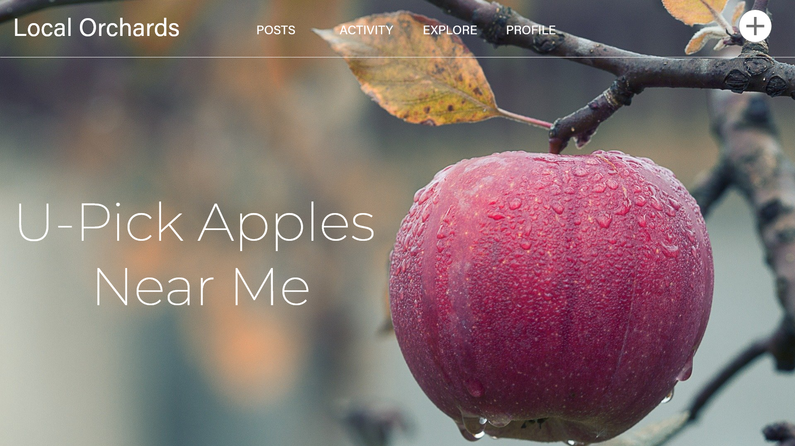
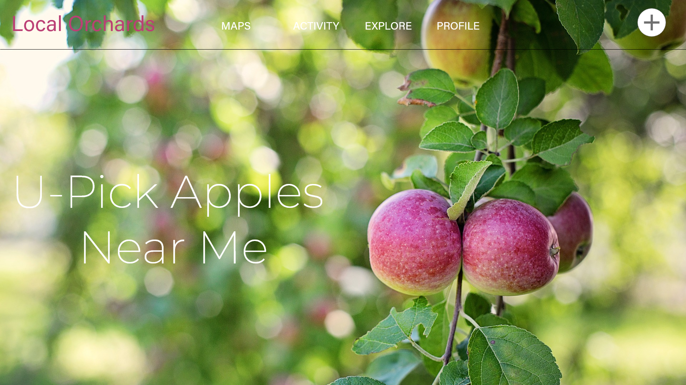

# localOrchards

Honors Senior Project at GVSU winter 2020

Journal: https://github.com/ClayNegen/localOrchards/wiki/Journal

# Getting Started

In order to run the app, change directories into /application and run 'npm install'. When this is finished, run 'npm start' and you are good to go!

# Tooling:

### Database:

Fire Base

### Framework:

React JS

### Component Styling:

Material UI

## Wire Frames

#

#

